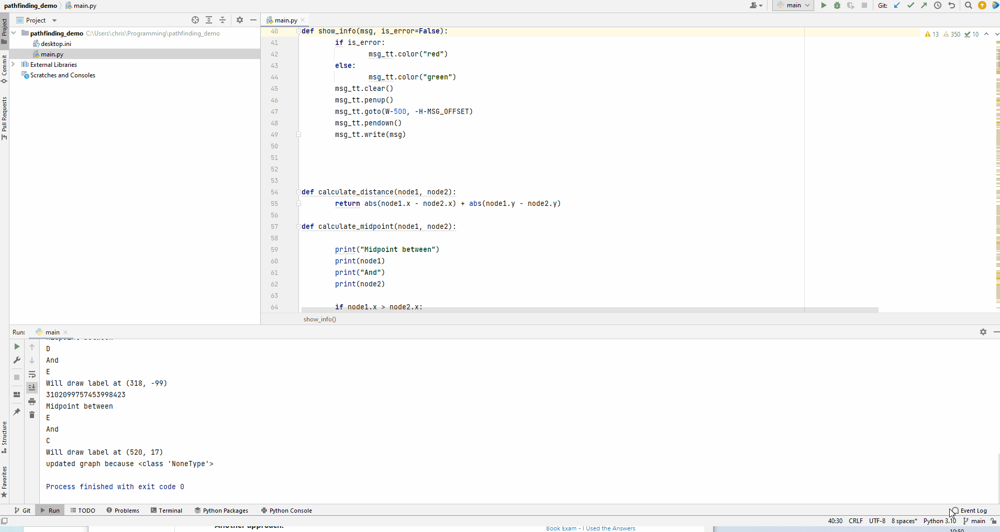
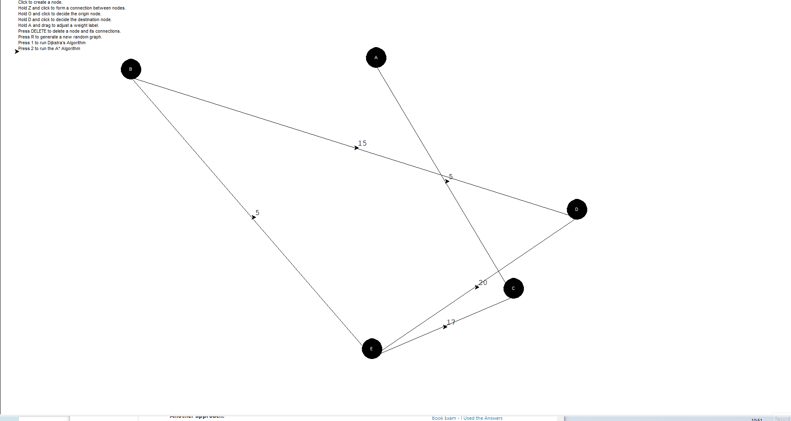
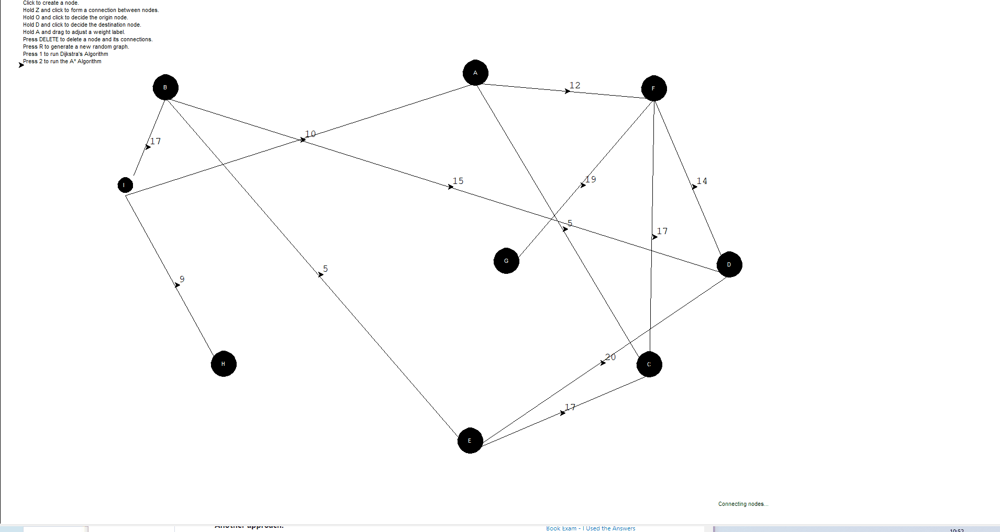
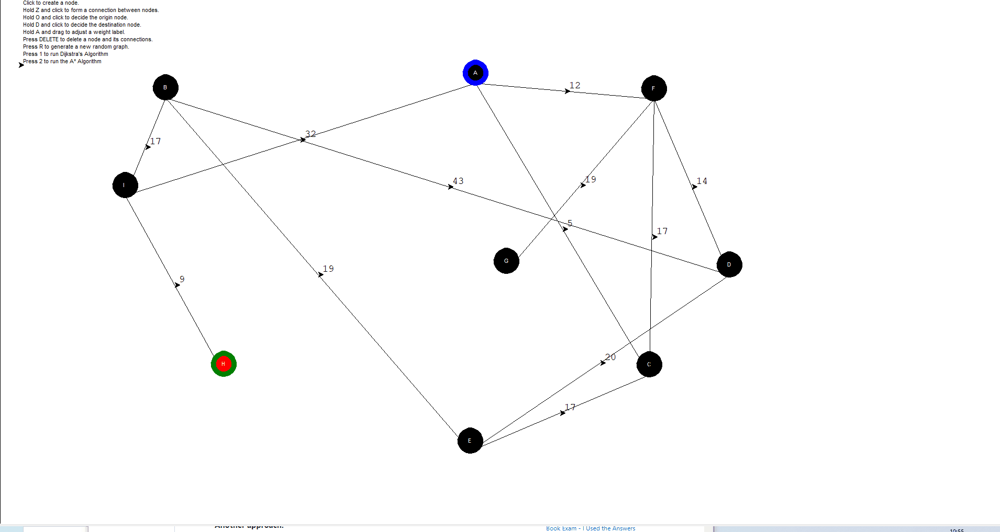
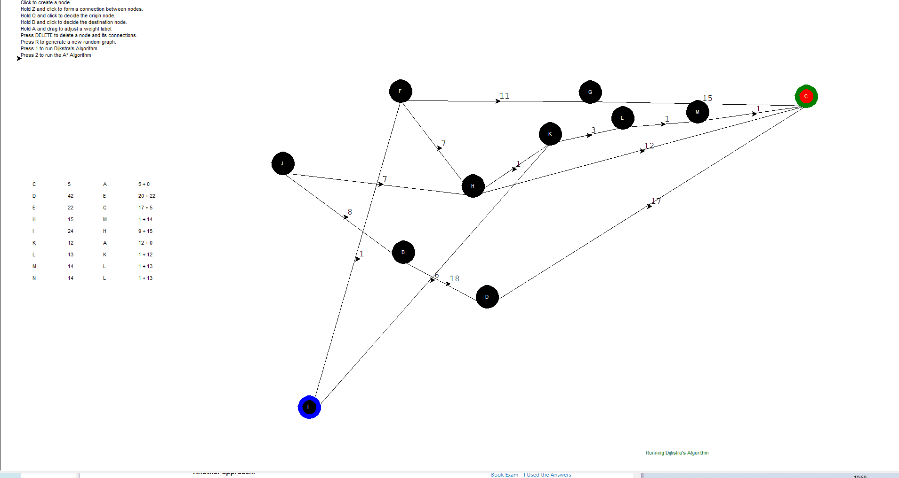
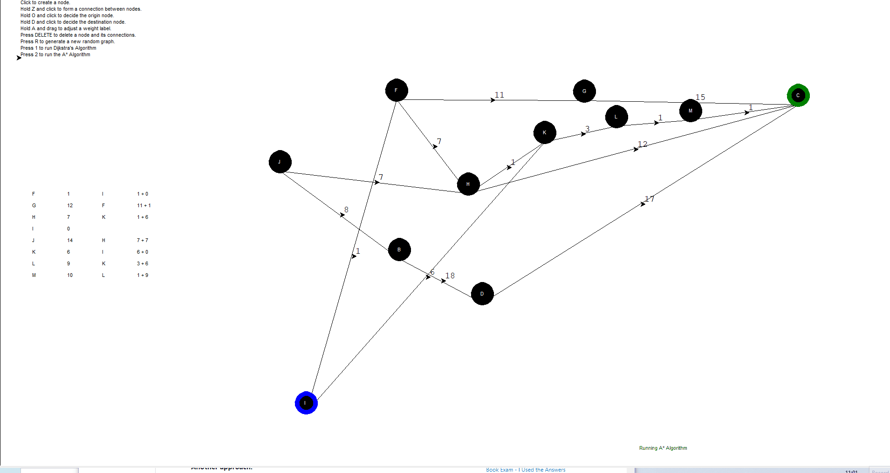

# pathfinding_demo

## Synopsis:

Having chosen to take a German elective instead of a module on 'Artificial Neural Networks' in my final year of university, I was not the most confident when it came to teaching ML and graph data structures / common algorithms on the new A Level syllabus for the first time this year.

To help myself learn Dijkstra's Algorithm and A\* Search Algorithm I decided to create a simulation using Turtle (!), in true amateur programmer Comp Sci teacher style!

It's not without its flaws, but currently has the following features:

### Create a random graph

### Add new nodes and form new connections

### Adjust weights between nodes

### Decide on origin and destination

### Prevent island nodes

### Delete nodes (and their connections)

### Run Dijkstra's algorithm on the graph

### Run A* algorithm on the graph

